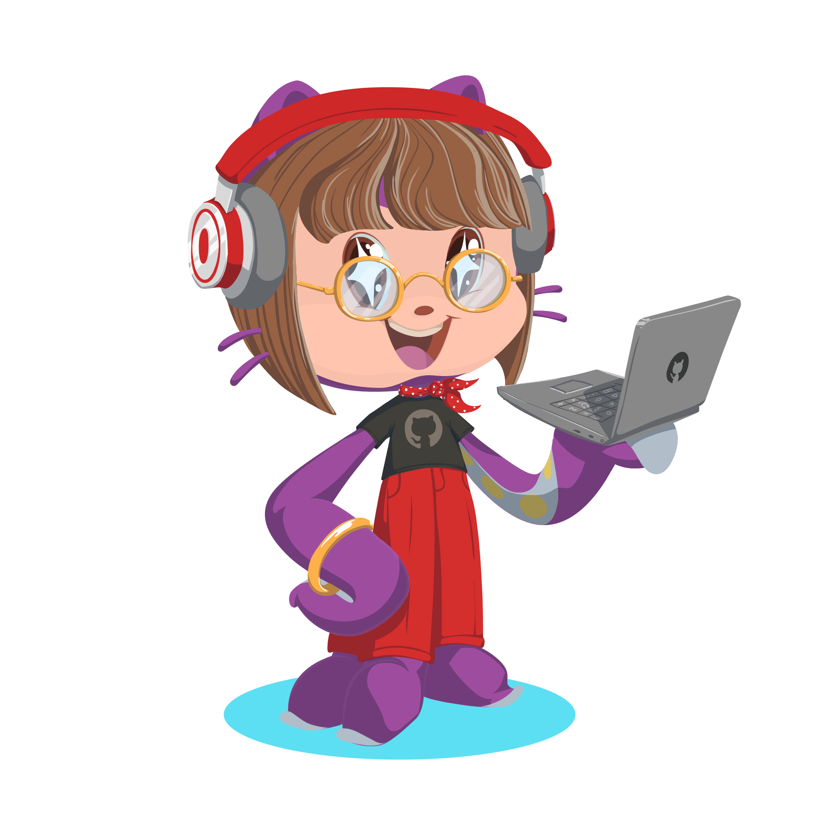

## Hello there 👋 I am Armağan!

I have been developing web-based systems for over 10 years now and within the years of experience, I have found a sweet spot that combines my technical skills with my diversity and inclusion advocacy and it is creating **inclusive, accessible and ethical software.** One great way of achiving this objective is through design systems especially when considering the system thinking philosophy always helped me comprehend "the big picture" hence make sense of things. So pursuing this passion lead me here, to [GitHub](https://github.com), where I work as a software engineer on [Primer Design System](https://primer.style) ✨

## Other things

- 🐶 Doggie mama is here.
- 👩‍💻 Pronouns: she/her/hers
- 🌱 My professional interests are Design Systems, Compassionate design, Web accessibility and Developer Experience.
- 💬 Reach out to me on Twitter [@broccolinisoup](https://twitter.com/broccolinisoup) to chat about frontend development, design systems, web accessibility, javascript, diversity&inclusion, coffee and dogs.
- I love camping 🏕️, hiking 🥾, beach walking 🏖️, cooking 🧑‍🍳 and [reading 📚](https://www.goodreads.com/user/show/50940270-arma-an) .  

 

